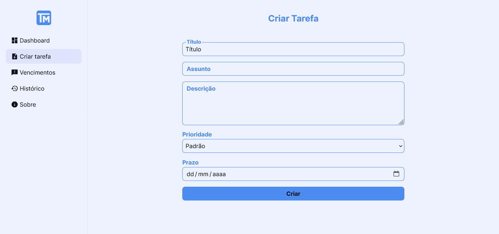

<h1 align="center">
    
</h1>

<h2 align='center'><a href='https://wendellwcl.github.io/TaskManager/' target='_blank' style='display: block; color: #fef27c; font-weight: bold; margin: 30px'>Acessar Site</a></h2>

<h2 style='color: #fef27c; border-bottom:none'>Descrição do projeto:</h2>

    O <a href='https://wendellwcl.github.io/TaskManager/' target='_blank' style='color: #fef27c; font-weight: bold;'>TaskManager</a> é uma aplicação projetada para ajudar seus usuários a organizar e gerenciar suas tarefas diárias. Com uma interface fácil de usar e recursos poderosos, o TaskManager simplifica o processo de gerenciamento de tarefas, aumentando a produtividade e a eficácia.
    <a href='https://wendellwcl.github.io/TaskManager/' target='_blank' style='display: block; color: #fef27c; font-size: 20px; font-weight: bold; margin-top: 30px'>Clique aqui para acessar o projeto completo.</a>

    

<h2 style='color: #fef27c; border-bottom:none'>Tecnologias utilizadas:</h2>
<ul style='list-style: none; list-style-type: none; display: flex'>
    <li style='display: flex; flex-direction: column; align-items: center; margin-right: 30px'>
        
        Angular
    </li>
    <li style='display: flex; flex-direction: column; align-items: center; margin-right: 30px'>
        
        TypeScript
    </li>
    <li style='display: flex; flex-direction: column; align-items: center; margin-right: 30px'>
        
        Sass
    </li>
    <li style='display: flex; flex-direction: column; align-items: center; margin-right: 30px'>
        
        HTML
    </li>
</ul>
